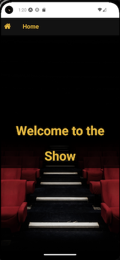
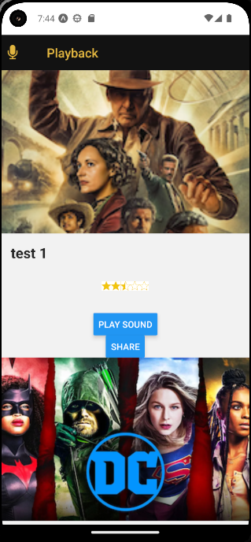

# MovieTroll

A community-driven mobile application for recording and playing audio commentary in conjunction with copywritten film and television releases.

## Description

MovieTroll is an app for people who love watching bad entertainment and talking over it the whole time, and for those who love satirized movies & TV.  MovieTroll's inspiration comes from growing up watching Mystery Science Theater 3000, and more recently, watching YouTubers go to great lengths in editing to avoid copyright infringements while creating content intended to satirize privately owned media products.  The objective is to breathe additional life into media products without cutting into studio revenue by leveraging an independently operational audio commentary system.  Just kidding.  The objective is to get a good laugh without violating copyright law.  But as far as J-Lo and Batfleck are concerned, does it reallly matter WHY we're watching 'Gigli' as much as the fact that we ARE watching 'Gigli'?

Future features of this project will include a backend linked to a movie database, syncing functions, storage for audio files, and a browser extension.  FUTURE future features will include the ability to rate commentaries, and algorithmic procedures for recommending commentaries based on review ratings and user preferences.  Lightyears into the future it will use audio recognition to sync with video players.

## Demo






## Getting Started


### Dependencies

#### Node Server
* cors 2.8.5
* crypto-js 4.1.1
* dotenv 16.0.3
* express 4.18.2
* jsonwebtoken 8.5.1
* mongoose 6.8.0
* nodemon 2.0.20
  
#### React Native App
* react-native-async-storage/async-storage ~1.17.3
* react-native-community/datetimepicker 6.5.2
* react-native-community/masked-view ^0.1.11
* react-native-community/netinfo 9.3.5
* react-native-picker/picker 2.4.8
* react-navigation/bottom-tabs 5.11.15
* react-navigation/drawer 5.12.9
* react-navigation/native 5.9.8
* react-navigation/stack 5.14.9
* reduxjs/toolkit 1.9.2
* axios ^1.4.0
* expo ~47.0.12
* expo-av ~13.0.3
* expo-constants ~14.0.2
* expo-image-manipulator ~11.0.0
* expo-image-picker ~14.0.2
* expo-mail-composer ~12.0.0
* expo-media-library ~15.0.0
* expo-notifications ~0.17.0
* expo-secure-store ~12.0.0
* expo-sharing ~11.0.1
* expo-status-bar ~1.4.0
* react 18.1.0
* react-native 0.70.8
* react-native-animatable ^1.3.3
* react-native-elements 3.4.3
* react-native-gesture-handler ~2.8.0
* react-native-reanimated ~2.12.0
* react-native-safe-area-context 4.4.1
* react-native-screens ~3.18.0
* react-native-swipe-list-view ^3.2.9
* react-redux 8.0.5
* redux 4.2.1
* redux-persist ^6.0.0
* typescript ^4.6.3

### Installing

* #### Node Server
  * Create a .env file in the node_server directory with a variable of MONGO_URL configured to a valid data cluster(https://www.mongodb.com/basics/clusters/mongodb-cluster-setup).
  * Use a terminal to navigate to the node_server directory and run the command:
    ``` 
    npm install
    ```
  * Import the MovieTroll.postman_collection.json to run tests in Postman

* #### React Native App 
  * Use a terminal to navigate to the react_native directory and run the command:
    ```
    yarn install
    ```

### Executing program
#### Node Server
    npm start

#### React Native App
    npx expo start

## Help

Any advise for common problems or issues.
```
command to run if program contains helper info
```

## Authors

Tyler Pritchard  
[@TylerPritchard](https://github.com/tyler-pritchard)

## Version History

* 0.2
    * Various bug fixes and optimizations
    * See [commit change]() or See [release history]()
* 0.1
    * Initial Release

## License

This project is licensed under the MIT License - see the LICENSE.md file for details

## Acknowledgments

Inspiration, code snippets, etc.
* [Audio Recording and Playback for Expo React Native Apps](https://www.youtube.com/watch?v=pd_Ez9Kbi2c)
* [GITREPO-reactnative-nucampsite-2.1](https://www.nucamp.co)
* [Photo by Felix Mooneeram](https://unsplash.com/@felixmooneeram?utm_source=unsplash&utm_medium=referral&utm_content=creditCopyText)(https://unsplash.com/s/photos/theater?utm_source=unsplash&utm_medium=referral&utm_content=creditCopyText)
